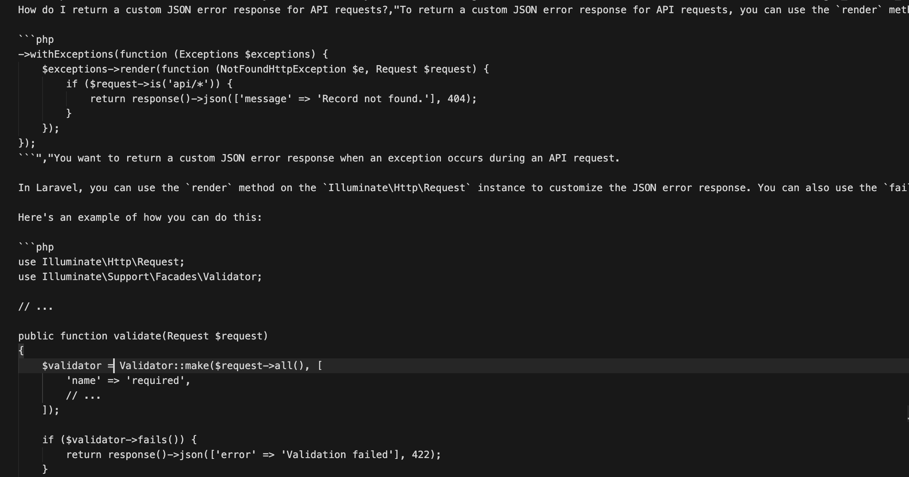
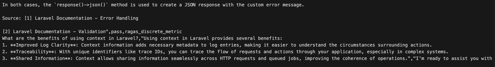

# Laravel Docs RAG Eval

This folder contains a practical evaluation harness for your Laravel docs RAG system.
It pulls a QA dataset, runs your retrieval chain, and scores each answer as `pass` or
`fail` using Ragas (with a fallback evaluator for local models).

## What this does

- Loads 200 questions from `yannelli/laravel-11-qa`
- Sends each question through your app chain (`build_chain()` from `search.py`)
- Grades responses against ground truth notes
- Writes a CSV with all questions, answers, and scores

## Screenshots

### Eval run



### Results view



## Quick start

From the `rag_eval` directory:

1) Install dependencies

```bash
uv sync
```

Or:

```bash
pip install -e .
```

2) Make sure your model endpoint is available

The current `evals.py` is configured for a local Ollama-compatible endpoint:

```python
client = OpenAI(api_key="ollama", base_url="http://localhost:11434/v1")
MODEL_NAME = "llama3.1"
```

If you switch providers, update the client and `llm_factory(...)` setup in `evals.py`.

3) Run the evaluation

```bash
uv run python evals.py
```

Or:

```bash
python evals.py
```

## Output

After a successful run, results are written to:

`rag_eval/experiments/laravel11_qa_eval_200.csv`

CSV columns:

- `question`
- `grading_notes`
- `response`
- `score` (`pass` or `fail`)
- `log_file` (whether Ragas metric or fallback judge produced the score)

## Customize it

### Change dataset size or source

Edit these constants in `evals.py`:

- `HF_DATASET`
- `MAX_QUESTIONS`
- `RANDOM_SEED`

### Change evaluation logic

Update `my_metric` in `evals.py` to adjust grading criteria, or replace the
fallback judge prompt in `fallback_judge(...)`.

### Change your RAG app behavior

The evaluated chain comes from `build_chain()` in `search.py`. Improve retrieval,
prompting, or reranking there and rerun this benchmark.

## File map

```text
rag_eval/
├── README.md
├── pyproject.toml
├── evals.py
├── experiments/
└── evals/
```

## Useful docs

- [Ragas docs](https://docs.ragas.io)
